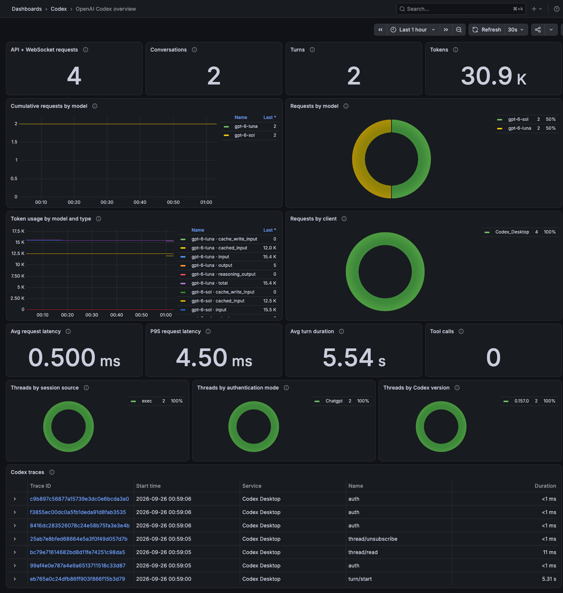

# Codex Observability for Grafana



Explore the OpenTelemetry metrics and traces emitted by Codex in a local Grafana stack. The dashboard is generated with the Grafana Foundation SDK for Go.

## What it shows

- API and WebSocket requests, conversations, turns, and token totals
- Request counts by model, token usage, and latency
- Request breakdowns by model and originating client
- Authentication mode, session source, and Codex version
- Codex traces in Tempo

The dashboard is inspired by Grafana's [OpenAI Codex overview](https://grafana.com/docs/grafana-cloud/observe-and-act/monitor-infrastructure/integrations/integration-reference/integration-openai-codex/). Some hosted panels rely on team-member identities that local Codex telemetry does not provide; this dashboard uses the originating client as a local breakdown instead.

## Quick start

Requirements: Codex CLI or the Codex desktop app, Docker with Compose, and [mise](https://mise.jdx.dev/).

1. Install the pinned Go toolchain:

   ```sh
   mise install
   ```

2. Merge the `[otel]` section from [`codex-otel.toml`](codex-otel.toml) into your user-level `~/.codex/config.toml`. Preserve any existing settings in that file. Codex ignores OTel settings in a project-level `.codex/config.toml`.

3. Start Grafana and its local OpenTelemetry backend:

   ```sh
   mise run up
   ```

4. Restart the Codex desktop app, or start a new CLI session, and use Codex to generate telemetry.

5. Open [Grafana](http://127.0.0.1:3000) and choose **Codex / OpenAI Codex overview**. On a fresh local stack, sign in with `admin` / `admin` and change the password when prompted.

## OpenTelemetry configuration

The example sends Codex metrics and traces to the local LGTM container over OTLP/HTTP. Log export is disabled, and `log_user_prompt` is set to `false`. Telemetry can still include operation names and attributes, so this setup is intended for local inspection.

Every panel follows Grafana's time picker, which defaults to the last 24 hours. Request counts include API and WebSocket metrics; model names come from Codex telemetry. Missing samples display as `0` or `No activity`.

## Develop

```sh
mise run test       # Run Go tests
mise run lint       # Run go vet
mise run fmt-check  # Check gofmt
mise run dashboard  # Regenerate the dashboard JSON
mise run build      # Build Go packages
mise run refresh    # Regenerate the dashboard and restart Grafana
mise run down       # Stop the local stack
```

The dashboard source is in [`internal/dashboards`](internal/dashboards). [`cmd/dashboardgen`](cmd/dashboardgen) writes the generated v2 dashboard resource to [`grafana/dashboards/codex.json`](grafana/dashboards/codex.json). CI checks that the generated file is up to date.

`mise run down` stops the containers but keeps the named data volume. To remove the local Grafana and telemetry data as well, run `docker compose down -v`.

## References

- [Codex observability configuration](https://developers.openai.com/codex/config-advanced)
- [Grafana OpenAI Codex integration](https://grafana.com/docs/grafana-cloud/observe-and-act/monitor-infrastructure/integrations/integration-reference/integration-openai-codex/)
- [Prometheus OpenTelemetry guide](https://prometheus.io/docs/guides/opentelemetry/)

## License

[MIT](LICENSE)
